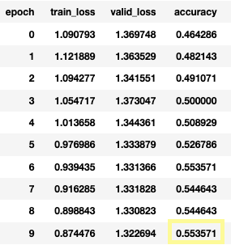
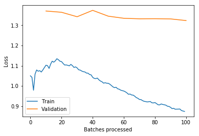
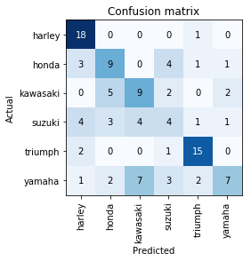

# Moto Classifier
This project, based on the following fast.ai courses, aims to leverage transfer learning of a pretrained ResNet CNN to classify between 6 makes of cruiser-style motorcycles. 
- https://course.fast.ai/videos/?lesson=1
- https://course.fast.ai/videos/?lesson=2

## Data
The data was collected from Google Images.  
There is a walkthrough of the process in [moto-create-dataset.ipynb](moto-create-dataset.ipynb).

## Follow Along
### Prerequisites
- PyTorch and fastai library
  - In depth [installation instructions](https://github.com/fastai/fastai/blob/master/README.md#installation)
  - In short: `$ conda install -c pytorch -c fastai fastai`
- Jupyter Notebook
  - `$ conda install -c anaconda notebook`
  - *Note*: JupyterLab will not work with `ImageCleaner` widget

### The Notebooks
To follow along, go through the notebooks in this order:
- [moto-create-dataset.ipynb](moto-create-dataset.ipynb)
  - Walkthrough of data collection process
  - A `data` directory (ignored) will be created and populated with your image data
- [moto-train.ipynb](moto-train.ipynb)
  - Train ResNet34
  - View most confused images (remove if neccessary)
  - Train ResNet50

## Results
After 20 epochs, the best accuracy achieved was 55.3%, which was after the second stage of training the ResNet34.  
Therefore the final, fully connected layer was trained for 10 epochs, and then the entire model was trained for an additional 10 epochs. 

 

 

